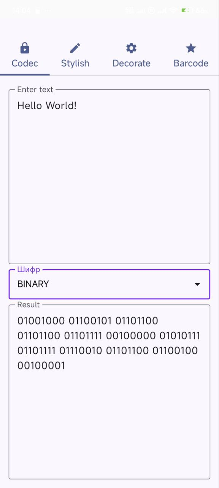
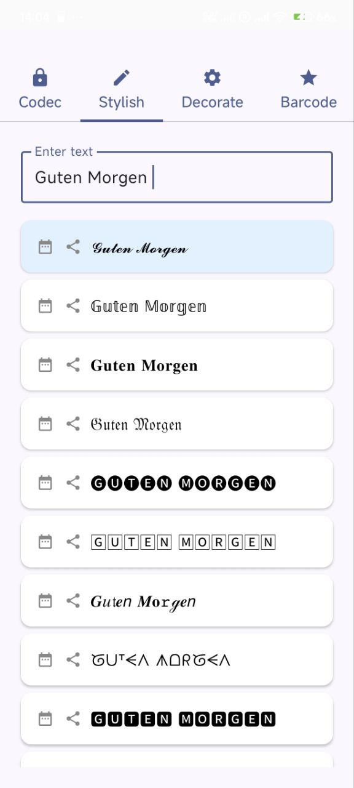
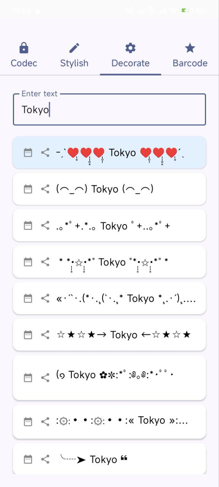

Text Converter

Text Converter is a handy and powerful Android app for transforming text into various fonts, styles, and encoding formats.

Features
Multiple font styles and fancy text effects (italic, bold, gothic, etc.)

Convert text to binary, hexadecimal, Base64, and more

Hashing and checksum generation (MD5, CRC32, CRC16,SHA256)

Decode encoded text back to normal

User-friendly interface with font and algorithm selection

Supports multi-line input and output

Screenshots

  
  
  
  

